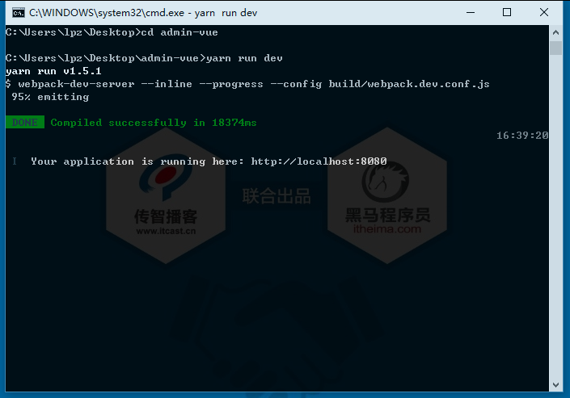

# 黑马程序员前端41期 Vue 电商后台管理系统开发文档

---

## 准备

### 将 API Server 部署到本地

- 创建一个名为 `itcast_mall` 的数据库
- 将 `mydb.sql` 导入 `itcast_mall` 数据库中
- 解压 `shop2-server.zip`
- 将 `shop2-server/config/default.json` 文件中 `db_config` 修改为自己的配置信息
- 打开终端，在 `shop2-server` 目录下执行 `npm start`

执行完 `npm start` 命令之后，如果看到如下提示信息则说明部署成功。


### API 接口文档

> http://shop-api.circle.ink/

### Postman 接口测试工具

- 是什么
  + 官网：https://www.getpostman.com/
- 下载安装
- 使用

---

## 项目初始化

### 使用 Vue CLI 初始化项目

- 是什么
- 解决什么问题
- 如何使用

**安装：**

```shell
npm install -g vue-cli
```

**查看使用帮助：**

```shell
vue --help
```

```
C:\Users\lpz\Desktop>vue --help

  Usage: vue <command> [options]

  Options:

    -V, --version  output the version number
    -h, --help     output usage information

  Commands:

    init           generate a new project from a template
    list           list available official templates
    build          prototype a new project
    help [cmd]     display help for [cmd]
```

**基于 [webpack](https://github.com/vuejs-templates/webpack) 模板初始化项目：**

```shell
# 基于 webpack 模板初始化一个名称为 admin-vue 的项目
vue init webpack admin-vue
```


启动开发模式：

```shell
cd admin-vue
yarn run dev
```



在浏览器中打开 `http://localhost:8080/` 访问测试。

### 项目结构介绍


```
build   webpack打包相关配置文件目录
config  webpack打包相关配置文件目录
docs  我们自己添加的文档目录
  开发文档.md  案例开发步骤文档
  接口文档.md  后台 API 接口文档
node_modules  第三发包
src  项目源码
  assegts  存储资源，例如 css、img、fonts
  components  存储所有组件
  router  路由
    index.js  路由配置文件
  App.vue  单页面应用程序的根组件
  main.js  开机键，负责把根组件替换到根节点
static  可以放一些静态资源
  .gitkeet  没啥用，用来充当一个文件就可以提交我们的 static 目录，未来有了其它文件可以把它删掉
.babelrc  es6转es5配置文件，给 babel 编译器用的
.editorconfig  给编辑器看的
.eslintignore  给eslint代码风格校验工具使用的，用来配置忽略代码风格校验的文件或是目录
.eslintrc.js  给eslint代码风格校验工具使用的，用来配置代码风格校验规则
.gitignore  给git使用的，用来配置忽略上传的文件
.postcssrc.js  给postcss用的，postcss类似于 less、sass 预处理器
index.html  单页面应用程序的单页
package-lock.json  锁定第三方包的版本，以及保存包的下载地址
package.json  项目说明，用来保存依赖项等信息
REAMDE.md  项目说明文档
```

### 代码风格

- **使用两个空格** – 进行缩进
- **字符串使用单引号** – 需要转义的地方除外
- **不再有冗余的变量** – 这是导致 *大量* bug 的源头!
- **无分号** – [这](http://blog.izs.me/post/2353458699/an-open-letter-to-javascript-leaders-regarding)[没什么不好。](http://inimino.org/~inimino/blog/javascript_semicolons)[不骗你！](https://www.youtube.com/watch?v=gsfbh17Ax9I)
- 行首不要以 `(`, `[`, or ``` 开头
  - 这是省略分号时**唯一**会造成问题的地方 – *工具里已加了自动检测！*
  - [详情](https://github.com/standard/standard/blob/master/docs/RULES-zhcn.md#semicolons)
- **关键字后加空格** `if (condition) { ... }`
- **函数名后加空格** `function name (arg) { ... }`
- 坚持使用全等 `===` 摒弃 `==` 一但在需要检查 `null || undefined` 时可以使用 `obj == null`。
- 一定要处理 Node.js 中错误回调传递进来的 `err` 参数。

### 加入 Git 版本控制

初始化本地仓库并完成一次提交。

```shell
git init
git status
git add --all
git commit -m ":tada: Initial commit"
```

在 GitHub 上创建一个在线仓库。

将本地项目推送到 GitHub。

```shell
git remote add origin https://github.com/你的GitHub用户名/admin-vue.git
git push -u origin master
```

### Git 工作流程

> [阮一峰 - Git 工作流程](http://www.ruanyifeng.com/blog/2015/12/git-workflow.html)

### 导入 ElementUI

> 参考文档：http://element-cn.eleme.io/#/zh-CN/component/quickstart

安装依赖：

```shell
yarn add element-ui
```

在 `src/main.js` 中加载使用：

```javascript
import Vue from 'vue'
import ElementUI from 'element-ui'
import 'element-ui/lib/theme-chalk/index.css'
import App from './App'
import router from './router'

Vue.use(ElementUI)

Vue.config.productionTip = false

/* eslint-disable no-new */
new Vue({
  el: '#app',
  router,
  components: { App },
  template: '<App/>'
})

```
